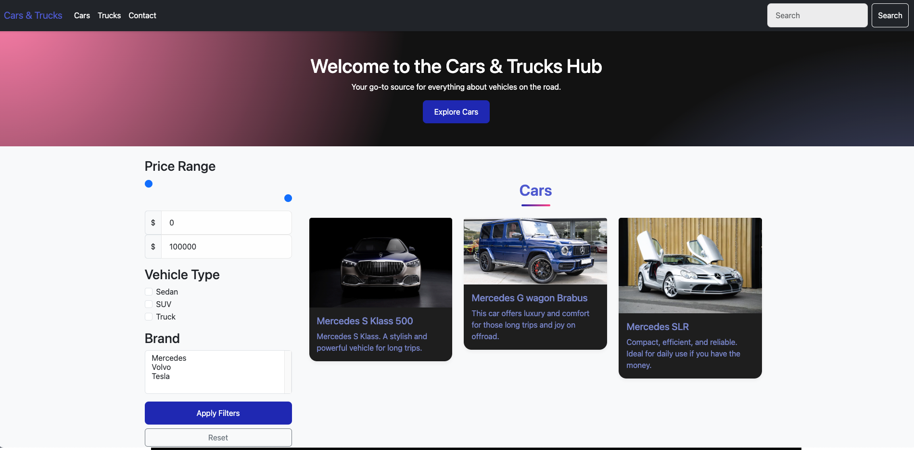

# Luxury Vehicle Dealership Website

## Overview
A modern, responsive website for a luxury car and truck dealership, featuring Mercedes and Volvo vehicles. The website provides an intuitive interface for browsing vehicles, with advanced filtering capabilities and a sleek, professional design.

## Features

### 🚗 Vehicle Showcase
- Detailed vehicle listings with high-quality images
- Comprehensive vehicle specifications
- Separate sections for cars and trucks
- Interactive vehicle cards with hover effects

### 🔍 Advanced Filtering System
- Brand-based filtering (Mercedes, Volvo)
- Vehicle type filtering
- Price range selection
- Real-time filter updates

### 💻 Responsive Design
- Mobile-first approach
- Fully responsive across all devices
- Optimized images for different screen sizes
- Adaptive navigation menu

### 🎨 Modern UI/UX
- Contemporary color scheme
- Smooth animations and transitions
- Intuitive navigation
- Professional typography

## Technologies Used
- HTML5
- CSS3
- JavaScript
- Bootstrap 5
- Google Fonts
- Font Awesome Icons

## Color Scheme
css
:root {

--primary-dark: #1A237E;    /* Deep Blue /
--primary: #3F51B5;         / Modern Indigo /
--accent: #FF4081;          / Pink Accent /
--background: #FAFAFA;      / Off-White Background /
--surface: #FFFFFF;         / Pure White */

}

## Project Structure
luxury-dealership/
├── index.html
├── trucks.html
├── contact.html
├── styles.css

## Setup and Installation
1. Clone the repository:
bash
git clone https://github.com/yourusername/luxury-dealership.git

2. Open the project in your preferred code editor

3. Launch the website:
- Using Live Server in VS Code, or
- Open `index.html` in your web browser

## Browser Support
- Chrome (latest)
- Firefox (latest)
- Safari (latest)
- Edge (latest)

## Future Enhancements
- [ ] Vehicle comparison feature
- [ ] Online booking system
- [ ] Virtual showroom tour
- [ ] Customer reviews section
- [ ] Vehicle financing calculator

## Contributing
1. Fork the repository
2. Create your feature branch (`git checkout -b feature/AmazingFeature`)
3. Commit your changes (`git commit -m 'Add some AmazingFeature'`)
4. Push to the branch (`git push origin feature/AmazingFeature`)
5. Open a Pull Request

## License
This project is licensed under the MIT License - see the [LICENSE](LICENSE) file for details.

## Authors
- Alexandru Berariu
- Andrei Apostol

## Acknowledgments
- Images sourced from authorized dealers
- Bootstrap framework
- Font Awesome icons
- Google Fonts        /* Pink
